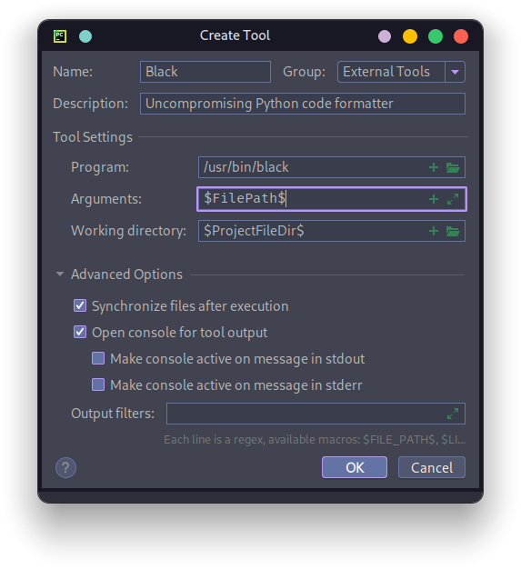
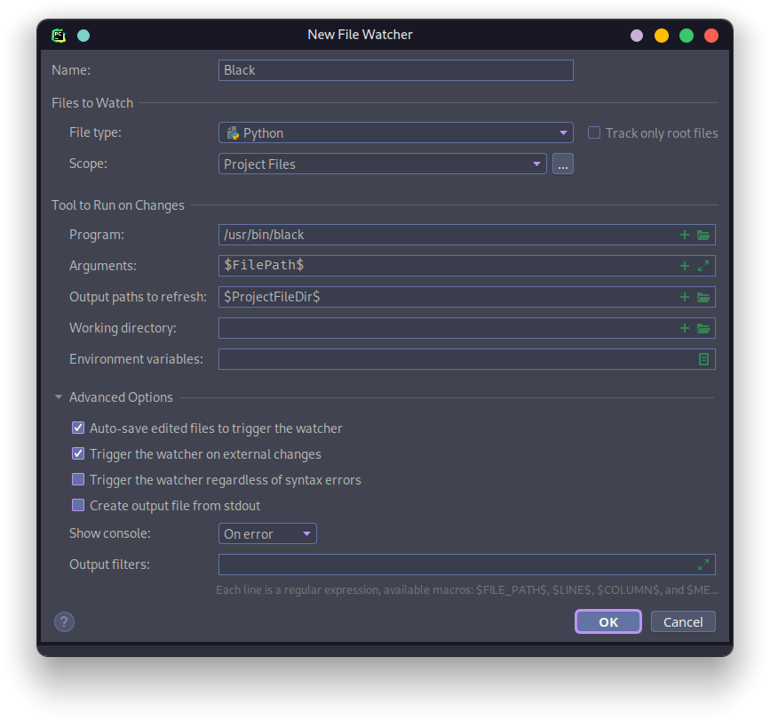
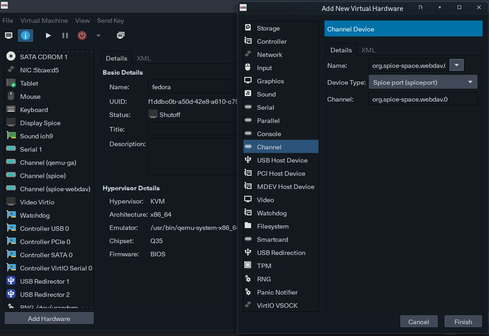
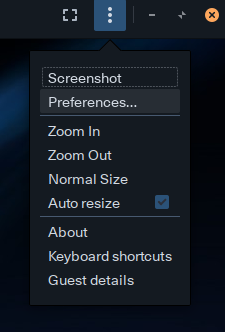
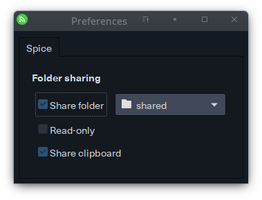
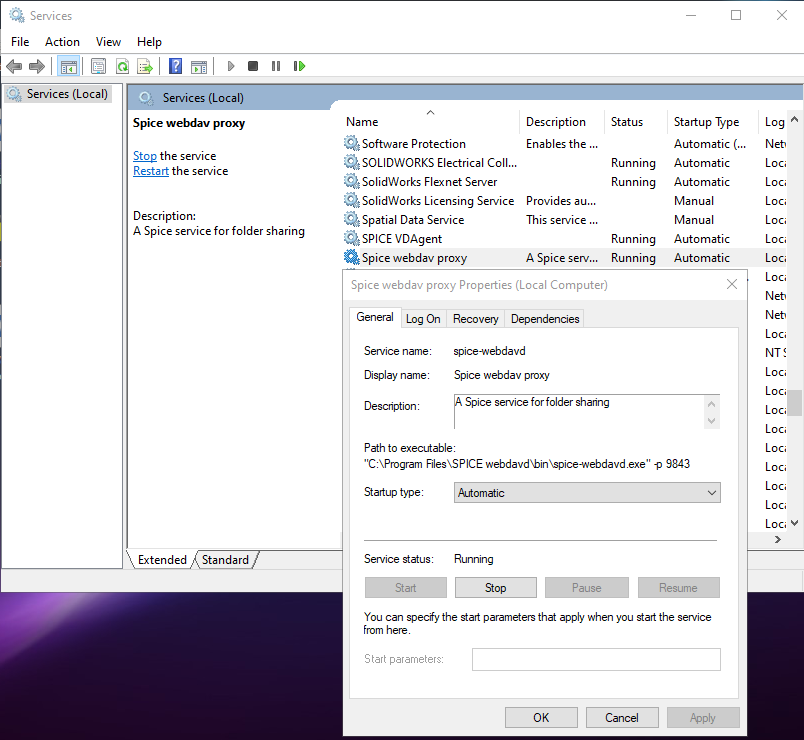
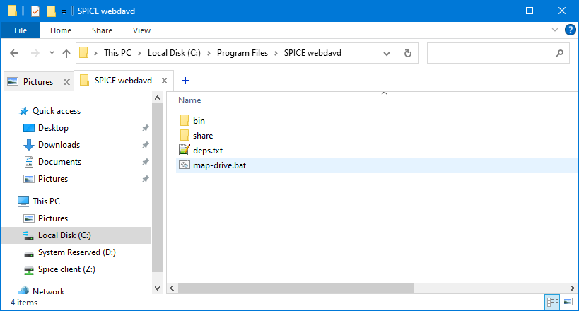
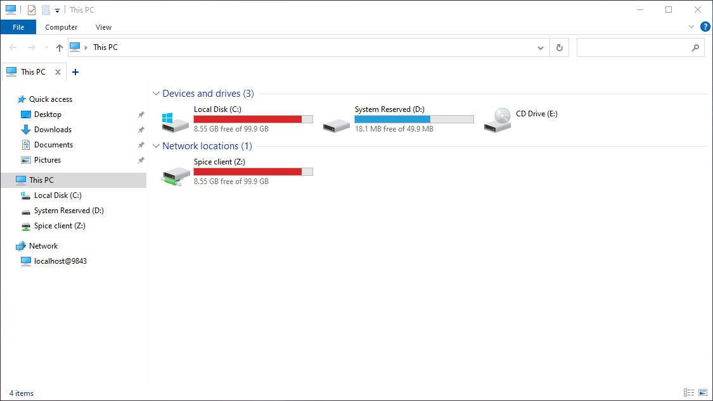

# General

### doxygen md main page ([source](https://stackoverflow.com/a/13442157))

```ini
INPUT                  = README.md other_sources
USE_MDFILE_AS_MAINPAGE = README.md
```

### matlab enable hardware rendering (nvidia)

```matlab
opengl('save', 'hardware')
```

### extract matlab installation files

```bash
unzip -X -K matlab_RXXXXy_glnxa64.zip
```

### matlab launcher

```bash
#!/usr/bin/env bash
#-------------------
# Run matlab
#-------------------
# export MATLAB_JAVA="/usr/lib/jvm/java-8-openjdk/jre"
export MATLAB_LOG_DIR="/tmp"
export LD_PRELOAD="/usr/lib/libfreetype.so"
#export LD_PRELOAD=/usr/lib/libstdc++.so
#export LD_LIBRARY_PATH=/usr/lib/xorg/modules/dri/
# prime-run /home/amad3v/apps/matlab/bin/matlab -desktop
export _JAVA_OPTIONS='-Dawt.useSystemAAFontSettings=on -Dswing.aatext=true'
export MATLABPATH="$MATLABPATH:/common/apps/mbeautifier:/common/matlab-drive/custom/"
prime-run "/common/apps/matlab/r2022a/bin/matlab" -desktop #-nosoftwareopengl

exit 0
```

### disable workspace trust in vscode

```json
"security.workspace.trust.enabled": false
```

### github: setup multiple accounts

From [section.io](https://www.section.io/engineering-education/using-multiple-ssh-keys-for-multiple-github-accounts/#how-to-manage-ssh-keys-on-github-accounts), __didn't work__

File to edit `~/.ssh/config`

```yml
# USER_1 account - the default config
Host github.com-USER_1
   HostName github.com
   User git
   IdentityFile ~/.ssh/id_rsa_USER_1
   
# USER_2 account
Host github.com-USER_2
   HostName github.com
   User git
   IdentityFile ~/.ssh/id_rsa_USER_2
```

From [oanhnn](https://gist.github.com/oanhnn/80a89405ab9023894df7)

```yaml
# Default github account: USER_1
Host github.com
   HostName github.com
   User git
   IdentityFile ~/.ssh/id_rsa_USER_1
   IdentitiesOnly yes

# Other github account: USER_2
Host github.com-USER_2
   HostName github.com
   User git
   IdentityFile ~/.ssh/id_rsa_USER_2
   IdentitiesOnly yes
```

### github: use multiple accounts

The default account is used as usual. Any other account, replace `github.com` in the URL with the value of `Host`

```bash
# git remote add origin git@<Host>:<user_name>/<repository>.git
git remote add origin git@github.com-USER_2:user_name/repository.git
```

### disable pc speaker

```bash
# disable for the session
sudo rmmod pcspkr
```

To disable it permanently create file `nobeep.conf` under `/etc/modprobe.d/nobeep.conf` with the following content:

```
blacklist pcspkr
```

### Superblock corrupted

Get the list of all superblocks

```bash
dumpe2fs /dev/<partition> | grep -i superblock
```

Use a backup superblock

```bash
e2fsck -f -b 98304 /dev/<partition>
```

To mount the filesystem using a superblock (e.g. 98304)

```bash
mount -o sb=98304 /dev/<partition> <mount point>
```

### Change `visudo` default editor

```bash
sudo visudo
```

Scroll to the bottom and add

```bash
# Full path is required
Defaults editor=/usr/bin/vim
```

### Enable GDM session chooser

Edit the `[daemon]` section of `/etc/gdm/gdm.conf` :

```
# full path to chooser.
Chooser=/usr/bin/chooser --disabe-sounds
```

### disable KDE wallet

```bash
kwriteconfig5 --file kwalletrc --group 'Wallet' --key 'Enabled' 'false' 
kwriteconfig5 --file kwalletrc --group 'Wallet' --key 'First Use' 'false'
```

### plasma-nm

if connected but `plasma-nm` keeps trying to connect, uninstall it, remove `kdewallet` and reinstall `plasma-nm`

### useful groups

```bash
sudo usermod -aG network,audio,power,kvm,lp,storage,tty $USER
```

### grub

```bash
# install in device not partition
# e.g. /dev/sda
sudo grub-install <device>

# configure
sudo grub-mkconfig -o /boot/grub/grub.cfg
```

### `sudo` without password

open sudoers file

```bash
sudo visudo
```

uncomment the line

```bash
%wheel ALL=(ALL) NOPASSWD: ALL
```

if it doesn't work check the files `/etc/sudoers.d/` and remove the one resetting this option.

A better aproach is to set this option for the concerned user by creating a file in `/etc/sudoers.d` with the name of the user preceeded by a number (priority) and an underscore

```bash
# create file (replace `user_name`)
sudo vim /etc/sudoers.d/00_user_name
```

add the following line, save and exit

```
user_name ALL=(ALL) NOPASSWD: ALL
```

### vscodium ms marketplace

open the file

```bash
/opt/vscodium-bin/resources/app/product.json
```

replace

```json
  "nameLong": "VSCodium"
  "extensionsGallery": {
    "serviceUrl": "https://open-vsx.org/vscode/gallery",
    "itemUrl": "https://open-vsx.org/vscode/item"
  }
```

with

```json
  "nameLong": "Code - OSS",
  "extensionsGallery": {
    "serviceUrl": "https://marketplace.visualstudio.com/_apis/public/gallery",
    "itemUrl": "https://marketplace.visualstudio.com/items"
  }
```

### black formatter

Add as external tool

```
File > Settings > Tools > External Tools
```

Name: `Black`

Program: `/usr/bin/black`

Arguments: `$FilePath$`

Working directory `$ProjectFileDir$`



Setup file watcher (pro only)

```
File > Settings > Tools > File Watchers
```

Name: `Black`

File type: `Python`

Scope: `Project Files`

Program: `/usr/bin/black`

Arguments: `$FilePath$`

Output paths to refresh: `$ProjectFileDir$`



### rust time code

```rust
use std::time::Instant;
let now = Instant::now();

/// Code to measure

let elapsed = now.elapsed();
println!("Elapsed: {:.2?}", elapsed);
```

### `passwd` config file

```
/etc/security/passwdqc.conf
```

found in `/etc/pam.d/system-auth`

### automount partition

Use `systemd-tools` to automount a partition.
Create a new `.mount` file in the `/etc/systemd/system/` directory. The file should have the same name as the mount path, with the `.mount` extension. If the mount path is `/mnt/partition` , then the file name should be `mnt-partition.mount` . Also add the user to the `disk` group to be able to read and write the partition.

Content of the `.mount` file:

```ini
[Unit]
Description=Mount data partition

[Mount]
What=/dev/partition_to_mount
Where=/mnt/data
Type=ext4
Options=defaults

[Install]
WantedBy=local-fs.target
```

### Add user to a group

```bash
sudo gpasswd -a $USER group_name
```

Or

```bash
sudo usermod -aG group_name $USER
```

### mount partitons without password

Add the user to the `storage` group and in `/etc/polkit-1/rules.d/` create a file named `00-npass-mount.rules` .

```js
polkit.addRule(function(action, subject) {
    if (action.id.match("org.freedesktop.udisks2.") && subject.isInGroup("storage")) {
        return polkit.Result.YES;
    }
});
```

### add `-shell-escape` to LyX

 1. `Tools` > `Preferences` > `File Handling` > `Converters`

 2. From `Converter Definitions` , select `LaTeX (pdflatex) -> PDF (pdflatex)`

 3. In the `Converter` box, change `pdflatex $$i` to `pdflatex -shell-escape $$i`

### find `nice` level

```bash
ps -o pid,comm,nice -p PID
```

all processes

```bash
ps -eo pid,comm,nice
```

### set the `nice` level for a process

The nice level can range from -20 (highest priority) to 19 (lowest priority). Default is 0.

```bash
sudo renice -n new_nice_level -p PID
```

### find the process ID (PID) of an application

```bash
pidof app-name
```

```bash
pgrep app-name
```

```bash
ps -ef | grep app-name
```

### reduce the CPU usage of an application

limit the amount of CPU time an application can use

```bash
cpulimit -p <PID> -l <percentage>
# start an app with limited cpu
cpulimit -l <percentage> -e <app-name>
```

change the CPU affinity of a process (which CPU cores it is allowed to run on)

```bash
taskset -cp <CPU_list PID>
```

### kvm: enable file sharing between Linux (host) and Windows (guest)

1. Go to `Add Hardware` > `Channel`
2. Under `Name`, select `org.spice-space.webdav.0`
3. Click `Finish`
   



4. Start the VM in `virt-viewer`
5. Got to `virt-viewer` menu `Preferences`
   



6. Check `Share folder` and select a directory
   



7. In the guest system run `services.msc`, go to `SPICE webdav proxy`, set `Startup type` to `Automatic` and start the service.
   



8. Run the batch file `C:\Program Files\SPICE webdavd\map-drive.bat`
   



9.  A new network drive will be created
    



### Ignore pylance warnings
Source: [type check diagnostics settings](https://github.com/microsoft/pyright/blob/main/docs/configuration.md#type-check-diagnostics-settings)
example:
```json
{
    "python.analysis.diagnosticSeverityOverrides":{
        "reportUndefinedVariable":"none"
    }
}
```
